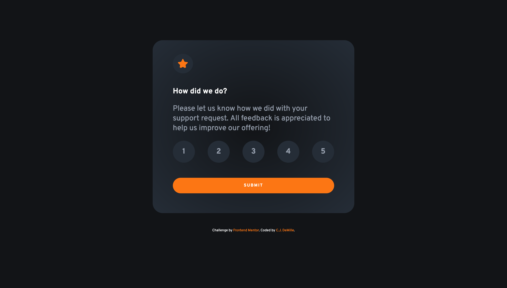

# Frontend Mentor - Interactive rating component solution

This is a solution to the [Interactive rating component challenge on Frontend Mentor](https://www.frontendmentor.io/challenges/interactive-rating-component-koxpeBUmI). Frontend Mentor challenges help you improve your coding skills by building realistic projects. 

## Table of contents

- [Overview](#overview)
  - [The challenge](#the-challenge)
  - [Screenshot](#screenshot)
  - [Links](#links)
- [My process](#my-process)
  - [Built with](#built-with)
  - [What I learned](#what-i-learned)
  - [Continued development](#continued-development)
  - [Useful resources](#useful-resources)
- [Author](#author)

## Overview

### The challenge

Users should be able to:

- View the optimal layout for the app depending on their device's screen size
- See hover states for all interactive elements on the page
- Select and submit a number rating
- See the "Thank you" card state after submitting a rating

### Screenshot

### Links

- Solution URL: [Add solution URL here](https://your-solution-url.com)
- Live Site URL: [Add live site URL here](https://your-live-site-url.com)

## My process

### Built with

- Semantic HTML5 markup
- CSS custom properties
- Flexbox
- Vanilla JavaScript
- Mobile-first workflow

### What I learned

This was good practice working with handling HTML forms in JavaScript. I also learned more about using styling inputs based on type, and styling the label for an input based on whether or not the input is selected. 

### Continued development

This feature could be built more efficiently with React. 

**Note: Delete this note and the content within this section and replace with your own plans for continued development.**

### Useful resources

- [Customize Radio Button Appearance with CSS](https://markheath.net/post/customize-radio-button-css) - This helped me with styling the inputs for the radio buttons using CSS

## Author

- Website - [C.J. DeMille](https://www.cjdemille.io)
- Frontend Mentor - [@cjdemille](https://www.frontendmentor.io/profile/cjdemille)
